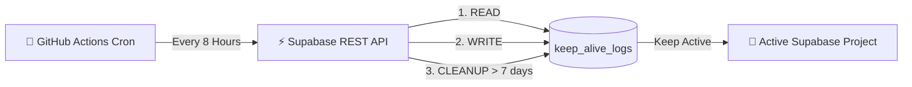

<div align="center">

# ⚡ SupaPulse (`SupaPulse`)

**Automated heartbeat & cron ping tool to keep Supabase Free Tier projects active 24/7.**

[](https://github.com/huynhtheviet/SupaPulse/.github/workflows/keep_alive.yml)
[](https://opensource.org/licenses/MIT)
[](https://nodejs.org/)
[](https://supabase.com)
[](https://github.com/huynhtheviet/SupaPulse/pulls)
[](https://github.com/huynhtheviet/SupaPulse)

<p align="center">
  <a href="#-why-supapulse">Why SupaPulse</a> •
  <a href="#-how-it-works">How It Works</a> •
  <a href="#%EF%B8%8F-quick-start">Quick Start</a> •
  <a href="#-alternative-no-code-option">No-Code Setup</a> •
  <a href="#-faq">FAQ</a> •
  <a href="#-license">License</a>
</p>

---

</div>

## 📌 Why SupaPulse?

Supabase pauses Free Tier projects after **7 consecutive days of inactivity** (no REST API queries or database connections). 

Because Supabase's internal `pg_cron` extension stops running when the database is paused, an **external online trigger** is required to send regular heartbeats.

**SupaPulse** solves this problem permanently by running scheduled **read, write, and cleanup operations** against your Supabase PostgREST API using **GitHub Actions**—completely automated, secure, and 100% free.

---

## ✨ Features

- ⚡ **100% Free & Automated**: Runs 24/7 on GitHub Actions with zero server costs.
- 🔄 **Real DB Activity**: Performs actual `SELECT` (Read) and `INSERT` (Write) database calls to ensure Supabase detects activity.
- 🧹 **Auto Log Pruning**: Automatically deletes heartbeat logs older than 7 days to keep your database clean and minimal.
- 🛡️ **Secure**: Credentials stored safely in GitHub Encrypted Secrets with Row Level Security (RLS) policies.
- ⏱️ **Flexible Schedule**: Default 3x daily (`00:00`, `08:00`, `16:00` UTC) or customizable to your needs.
- 🌐 **No-Code Fallback**: Supports 3rd-party web cron services like `cron-job.org` if you prefer not to use GitHub Actions.

---

## 🏗️ How It Works



---

## 🛠️ Quick Start

### Step 1: Create Database Table in Supabase

1. Log in to your [Supabase Dashboard](https://supabase.com/dashboard).
2. Open your project -> Navigate to the **SQL Editor**.
3. Copy and run the SQL script from [`sql/schema.sql`](./sql/schema.sql):

```sql
-- Create table for storing keep-alive heartbeat logs
CREATE TABLE IF NOT EXISTS public.keep_alive_logs (
    id UUID DEFAULT gen_random_uuid() PRIMARY KEY,
    created_at TIMESTAMPTZ DEFAULT now() NOT NULL,
    status TEXT NOT NULL DEFAULT 'active',
    note TEXT
);

-- Enable Row Level Security (RLS)
ALTER TABLE public.keep_alive_logs ENABLE ROW LEVEL SECURITY;

-- Set up policies for anon key access
CREATE POLICY "Allow anon read keep_alive_logs" ON public.keep_alive_logs FOR SELECT TO anon, authenticated USING (true);
CREATE POLICY "Allow anon insert keep_alive_logs" ON public.keep_alive_logs FOR INSERT TO anon, authenticated WITH CHECK (true);
CREATE POLICY "Allow anon delete keep_alive_logs" ON public.keep_alive_logs FOR DELETE TO anon, authenticated USING (true);
```

---

### Step 2: Deploy to GitHub Actions

1. **Fork or Push** this repository to your GitHub account:
   ```bash
   git init
   git add .
   git commit -m "feat: initial release of SupaPulse ⚡"
   git branch -M main
   git remote add origin https://github.com/<huynhtheviet>/SupaPulse.git
   git push -u origin main
   ```

2. **Retrieve your Supabase API Credentials**:
   - Go to Supabase Dashboard -> **Project Settings** -> **API**.
   - Copy your **Project URL** and `anon` `public` API key.

3. **Configure GitHub Secrets**:
   - In your GitHub Repository -> Go to **Settings** -> **Secrets and variables** -> **Actions**.
   - Click **New repository secret**:
     - `SUPABASE_URL`: `https://your-project-ref.supabase.co`
     - `SUPABASE_KEY`: `your-anon-or-service-role-key`

4. **Verify Execution**:
   - Go to the **Actions** tab in your GitHub repository.
   - Select **SupaPulse Heartbeat** -> Click **Run workflow**.
   - Check your Supabase `keep_alive_logs` table to confirm the log entry!

---

## 🌐 Alternative: No-Code Setup (cron-job.org)

If you prefer not to host code on GitHub, you can use a free web cron service like [cron-job.org](https://cron-job.org):

1. Create a free account at [cron-job.org](https://cron-job.org).
2. Create a new Cron Job with the following details:
   - **URL**: `https://<YOUR-PROJECT-REF>.supabase.co/rest/v1/keep_alive_logs`
   - **Schedule**: Every 8 hours (or 1-3 times daily)
   - **HTTP Method**: `POST`
   - **Headers**:
     - `apikey`: `<YOUR-SUPABASE-ANON-KEY>`
     - `Authorization`: `Bearer <YOUR-SUPABASE-ANON-KEY>`
     - `Content-Type`: `application/json`
   - **Request Body**: `{"note": "Ping from cron-job.org"}`

---

## 🧪 Local Testing

To test the heartbeat script locally on your machine:

1. Clone the repository & copy `.env.example`:
   ```bash
   cp .env.example .env
   ```
2. Fill in your `SUPABASE_URL` and `SUPABASE_KEY` inside `.env`.
3. Run the script:
   ```bash
   npm start
   ```

---

## ❓ FAQ

<details>
<summary><b>Does this violate Supabase Terms of Service?</b></summary>
<br/>
No. Sending regular API queries to your own database is standard API usage. Supabase pauses inactive projects to clean up abandoned projects, not actively used ones.
</details>

<details>
<summary><b>Will this consume my database storage limit?</b></summary>
<br/>
No. SupaPulse includes an automated cleanup step (`STEP 3/3`) that deletes heartbeat logs older than 7 days. Your table size will remain virtually zero (< 1 KB).
</details>

<details>
<summary><b>How often should SupaPulse run?</b></summary>
<br/>
Once every 1 to 3 days is sufficient to prevent deactivation (Supabase pauses after 7 full days of inactivity). The default schedule runs 3 times daily to guarantee high availability.
</details>

---

## 🤝 Contributing

Contributions, issues, and feature requests are welcome!  
Feel free to check the [issues page](https://github.com/huynhtheviet/SupaPulse/issues).

---

## 📜 License

Distributed under the MIT License. See [`LICENSE`](./LICENSE) for more information.

---

<div align="center">

**⭐ Star this repository if it saved your Supabase project from being paused! ⭐**

Made with ❤️ for the open-source community.

</div>
